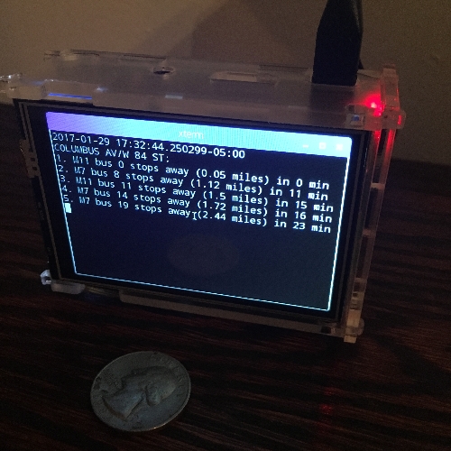

# rasbus
Display nearby NYC MTA buses on a raspberry



## acknowledgements

Per the copyright notice in this repository, the python code was largely
copied one file in a much more impressive
[project](https://github.com/ianwestcott/bustime-display)
by Ian Westcott.

## hardware

This is made from a Raspberry Pi B with a raspberry sized
screen with case from [Kuman](https://www.amazon.com/gp/product/B01FXC5ECS/),
which appears to be a cheaply made clone of a screen from
[Waveshare](http://www.waveshare.com/wiki/3.5inch_RPi_LCD_(A)).


## basic raspberry setup

I installed the
[raspbian lite image](https://downloads.raspberrypi.org/raspbian_lite_latest)
(2017-01-11 version, fwiw)
to a micro-sd in one of the standard ways.

To my dismay, ssh was not enabled by default, so I actually had to attach the
thing to an hdmi display and keyboard.  Logging in as pi/rasperry,

```.sh
sudo /etc/init.d ssh status # shows disabled
sudo update-rc.d ssh enable
passwd # change
cd $HOME
mkdir .ssh
cat > .ssh/authorized_keys # add my key
```
At this point, one never needs to connect a keyboard again.  I assembled the
display and case, powered back up and ssh'd in.

The web abounds with hints on proper configuration for the screen.
The most unpleasant version has you install a special OS image from a CD
that comes with the display, but I obviously didn't do that.  There are
also claims that current versions of raspbian have all necessary drivers
already, but this didn't work for me.  What eventually did work was
the [driver package](http://www.waveshare.com/w/upload/4/4b/LCD-show-161112.tar.gz) from Wave share, which untars into a directory of utilities.  One is
supposed to
```.sh
sudo LCD36-show
```
and, after poking around to convince myself that it didn't do anything
obviously malicious, I did.  The raspberry rebooted, and I now saw all
the boot text in very tiny print on the somewhat tiny screen!

I installed a bunch of X/GUI stuff. You probably don't need all of it.
```.sh
sudo apt-get install lightdm  # login manager
sudo apt-get install --no-install-recommends xserver-xorg
sudo apt-get install --no-install-recommends xinit
sudo apt-get install xinit xorg xterm
sudo apt-get install raspberrypi-ui-mods # PIXEL window manager
```

Now, you can use `raspi-config` and decide whether the thing should
boot up running a window manager and if so, whether you're already logged
on.  The alternative is starting the server manually with xinit.

While you're installing things,
```.sh
sudo apt-get install python-pip python-dev build-essential 
```

## Getting bus information

The MTA provides bus information as rather simple JSON, rather than
the GTFS protobufs used for the subways.  You still need an API key; the
subway key won't work, if you happen to have one.
You [apply](http://bustime.mta.info/wiki/Developers/Index) and get sent
a key nearly immediately.  I put it in a file named `APIKEY`, which you'll
notice is properly excluded in the `.gitignore` for this project.

Now you can find out about buses approaching a particular stop from
```.txt
http://bustime.mta.info/api/siri/stop-monitoring.json?key=YOUR_KEY_HERE&MonitoringRef=401094
```
The `MonitoringRef` is a stop ID, in this case one on the Upper West Side
of Manhattan; if you live in NYC, you'll know all about stop IDs.
There are other api calls, but this is the main one.

I started with Ian's
[stopmonitoring.py](https://github.com/ianwestcott/bustime-display/blob/master/flask/bustime/stopmonitoring.py) and made a few modifications.  In no
particular order:

* Throw in `try/except` in places where there were intermittent failures.
* Read the `ExpectedArrivalTime` field.
* Write a more complicated `__str__` method for the `Visit` class (which holds
  information about an upcoming bus arrival) that, among other things,
  parses the arrival time and calculates the number of minutes the bus is away.
* Wrote a basic `__main__` block that initializes things and runs the
  query every 60 seconds.

Along the way, I kept discovering modules I needed on the raspberry.  In
total:
```.sh
sudo pip install request jsonpickle dateutil dateutil.parser python-dateutil pytz
```

These days, I just run an xterm
```
xterm -display :0 -fa 'Monospace' -fs 12 ./rasbus.py &
```
which fills up the entire display.  I had plans to do this automatically,
but the thing's been running for months now, so I haven't bothered.

